# Re(flex) - Flex your reflexes
Re(flex) is a game that will test the users reflexes, but not in the conventional way. We are used to waiting for red light to turn green to press a button to measure our reflexes, but this game will measure your reflexes to let go of a key at a specified time. There is something psychologically different to pressing a key at a specified time versus letting go of a key at a specified time. 

This game will be for adults and children alike, and it will provide a fun game that helps sharpen your reflexes (and possibly flex them) to your family, friends and colleagues. 
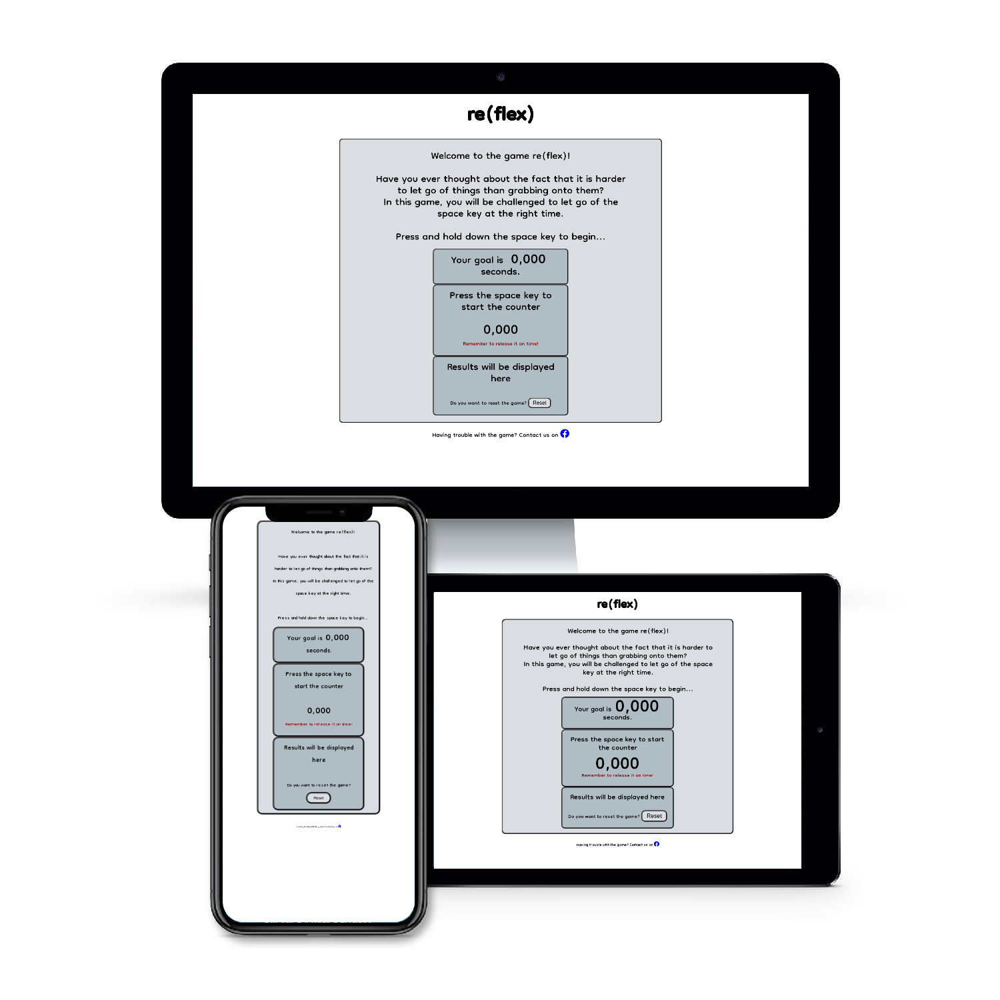

## Features

### ___Existing Features___
 - #### __Header__
   - The header will be placed up top of the page and aligned to center. Re(flex) will be displayed with a fun font.
   - The name of the game reveals that it has to do with reflexes, and your chance to flexing them to others. 
   

 - #### __Game Area__
   - This section will have a different colored background and contain the game itself.
   - It will provide a random number that is the goal of the game.
   - The counter will start as the user presses down a key and will stop once the user releases the key.
   - Once the user has released the key, the result is logged and a new randomly generated goal will be shown.
   - Dependant of the result (a margin of 0,2 seconds) will display the counter with a green background if user succeeds or a red background if the user doesn't succeed. 
   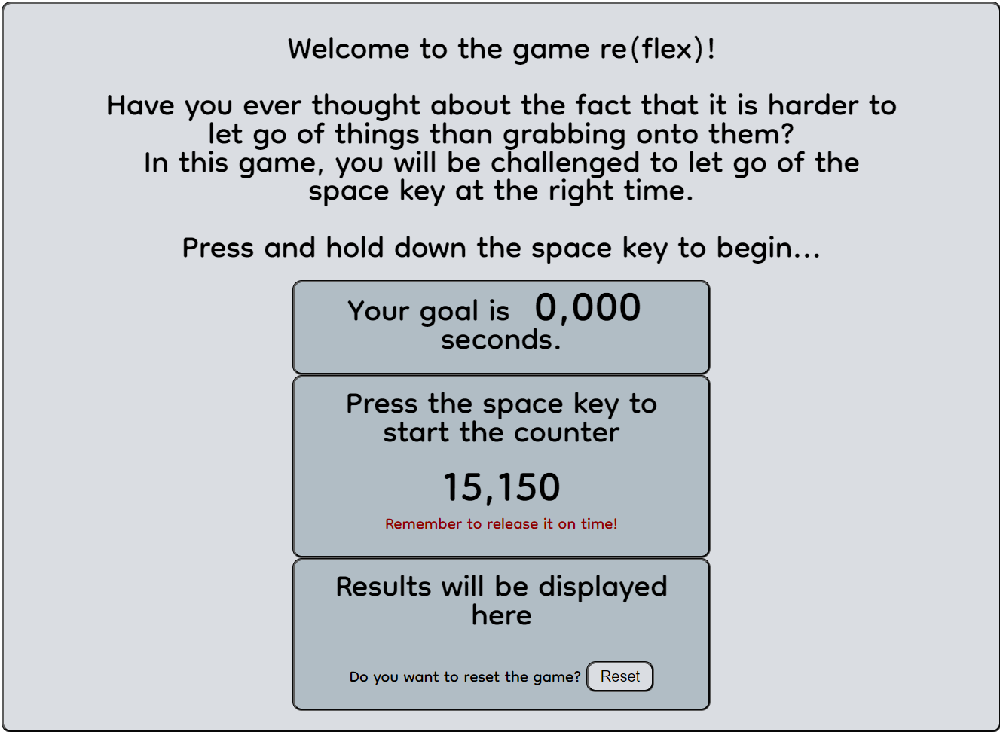

 - #### __Results Area__
   - Below the time counter results will be displayed to the user.
   - If you are within 0.2 seconds before or after the goal, you will get a green box with the difference within it.
   - If you are more than 0.2 seconds before or after the goal, the box will be red with the difference within it.
   - If the user clicks New Game button the results area will be reset. 
   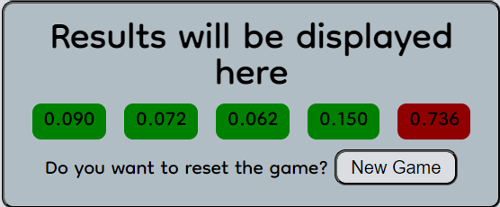
  
 - #### __Alert Message__
   - After five rounds you will be alerted with a message indicating that the game is now over as well as thanking the user for playing.
   - The alert has a delay added to it so that the game has enought time to calculate the result of the last round before sending the alert. 
   

 - #### __Reset game button__
   - At the bottom of the game area there will be a button to click on if the user would like to reset the game. 
   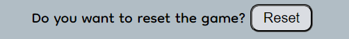

 - #### __Footer__
   - A footer will be fixed on the bottom displaying the rules of the game in short sentences. 
   

### ___Future Features___
- In the future I would like to add sound effects to the game to make it more fun.
- I would also like to add the ability to make a leaderboard that users can opt into and save their best score to compete against other players.

## UX

### __User Stories__
 - As as user, I would like to play a game.
 - As a user, I would like to test my reflexes.
 - As a user, I would like to reset the game.
 - As a user, I would like to contact the developer when something is not working.

## Design

### __Fonts__
 - I used [Google Fonts](https://fonts.google.com/) for finding a fun font.

### __Colour schema__
 - I used [ColorSpace](https://mycolor.space/?hex=%23FFFFFF&sub=1) for finding a good looking colour palette to #FFFFFF.

### __Icons__
 - I used [Font Awesome](https://fontawesome.com/) to get a nice Facebook icon to the footer.

## Wireframes

### __Desktop__
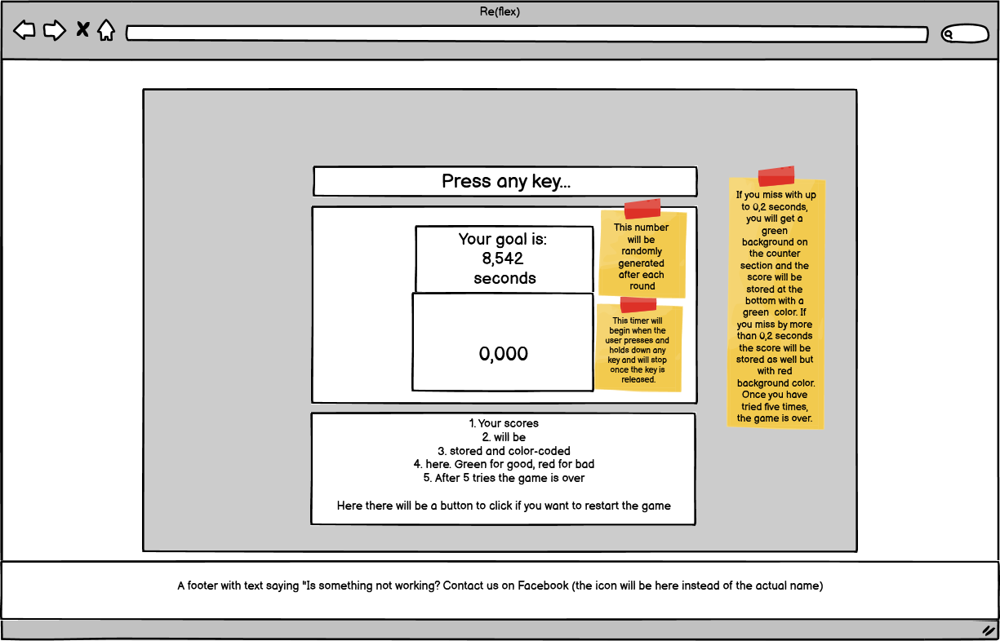

### __Tablet__
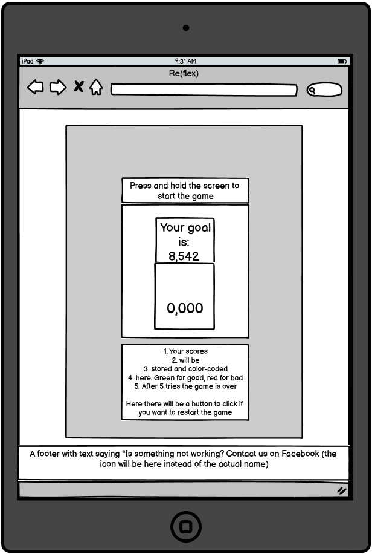

### __Phone__
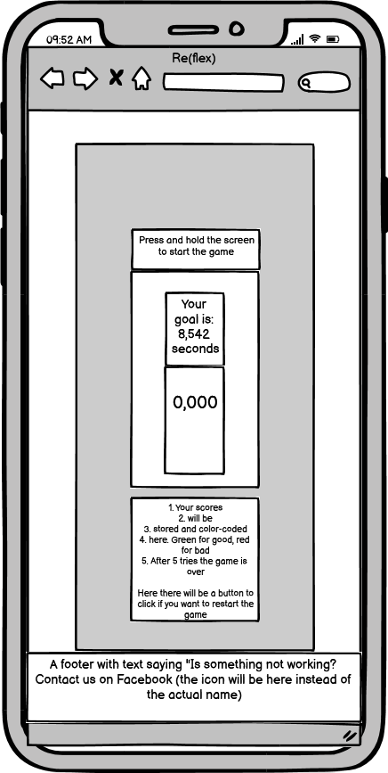

## Technology

### __GitHub__
- GitHub is where the code is stored and the site was hosted.

### __GitPod__
- GitPod is the developer environment in the cloud.

## Testing

### __Code validation__
- HTML validator 

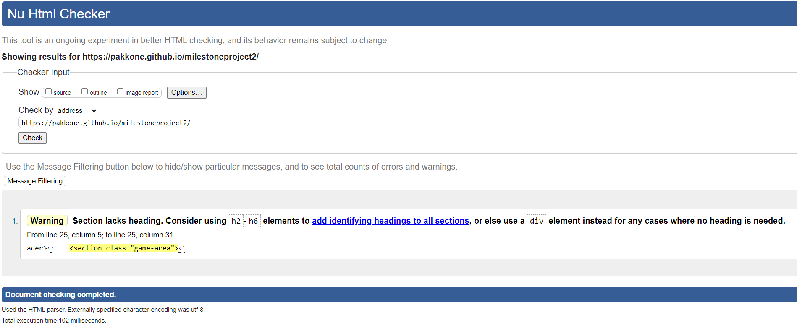
- CSS validator 

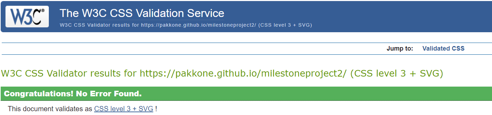
- JSHint validator 

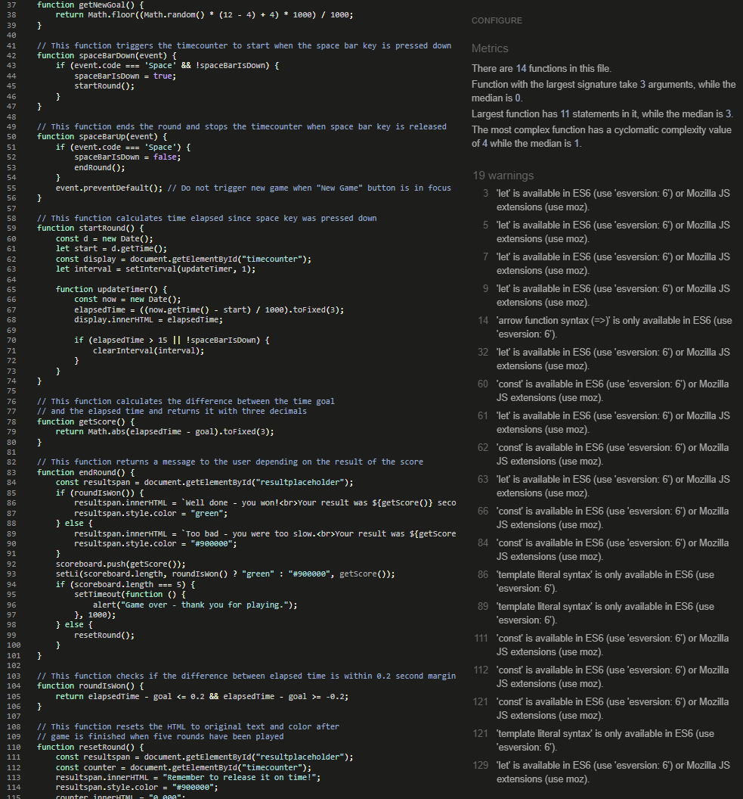
- Lighthouse 

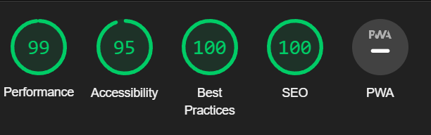

### __Test cases__
- Load game
  - Whenever I refresh the page, it loads the game correctly with a new randomly generated number as a goal. 
  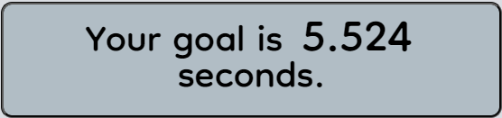
- Start round
  - I tested pressing any key other than space key and it doesn't start the round.
  - When I press and hold down space key the time counter starts counting up. 
  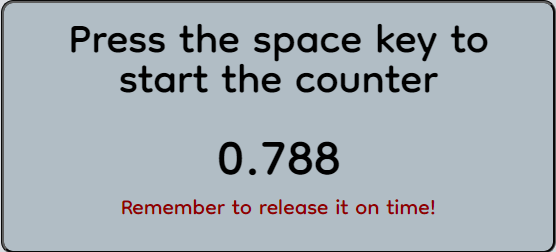
- End round
  - I tested releasing the space key as close as possible to the goal and it worked, the counter stopped and result was calculated.
  - I tested holding the space key down longer than the goal and it stopped at 15 seconds which I wanted it to since the goal will never be more than 12 seconds. 
  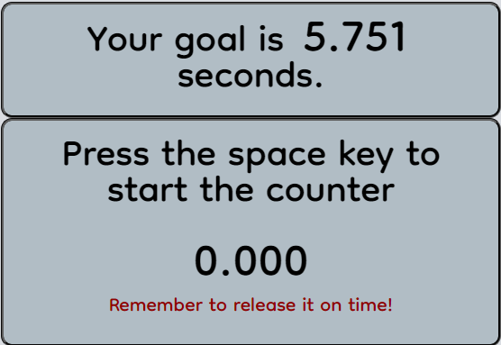
- End game
  - I tested finishing five rounds to see if the game was ending on its own and displaying the alert, which it did. 
  
- Reset game / "New Game" button
  - I tested the New Game button after 1, 2, 3 and 4 rounds and it worked, the game was reset and a new randomly generated time goal was set. 
  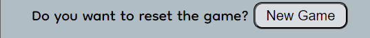
- Footer / Facebook icon
  - I tested clicking on the Facebook icon and it opened the Facebook website in a new tab. 
  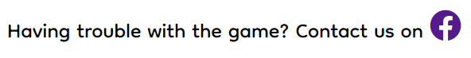

### __Fixed bugs__
 - Expected: The alert message should have been displayed after the result of the last round had been calculated and the last results box was made either green/red.
   - What actually happened was that the last results box was still gray and said "0,000" when the alert message was sent.
   - This was resolved by using the setTimeout function:  ``setTimeout(function () {
            alert("Game over - thank you for playing.");
        }, 1000);``
 - Expected: The results area should display five boxes with results of your played game.
   - What actually happened was that the five containers were not wrapping on some smaller screen sizes making them pop outside the div they are a part of.
   - I solved it by adding `` flex-wrap: wrap; `` to the CSS code for that section.

### __Supported screens and browsers__
- It has been tested on Safari, Brave Browser, Google Chrome, Mozilla Firefox and Microsoft Edge and works well.
- It has also been tried on Safari on iPad as well as iPhone with a bluetooth keyboard connected and works well.

## Deployment

### __Via GitPod__
- GitPod was used as the environment for development. These are the steps to set it up:
  - I used Code Institute Python Essentials template (https://github.com/Code-Institute-Org/python-essentials-template)
  - Click Use this template.
  - GitPod will now set up the environment for you with all addons/shortcuts needed.'
  - To run the program in GitPod what you have to do is type in python3 run.py in the terminal.

### __Via GitHub Pages__
- The site was deployed to GitHub Pages. These are the steps to make it happen:
  - Go to the relevant repository, then click Settings.
  - Click on Pages on the left column.
  - Under source, pick main and also make sure that /root is selected. Click Save.
  - The site will then be deployed within 10-15 minutes and the link should be shown above the Source section.

Find my site here: https://pakkone.github.io/milestoneproject2/

## Credits

#### HTML/CSS code
- I got my freshly reminders of HTML/CSS code from [W3Schools](https://www.w3schools.com/).

#### JavaScript code
- My friend [David Hyldgaard](https://www.linkedin.com/in/davidhyldgaard) helped me map out how I should use the functions.